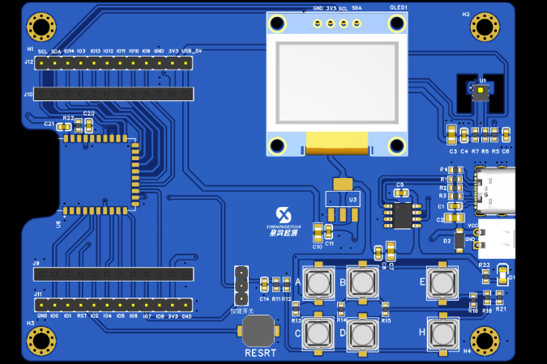
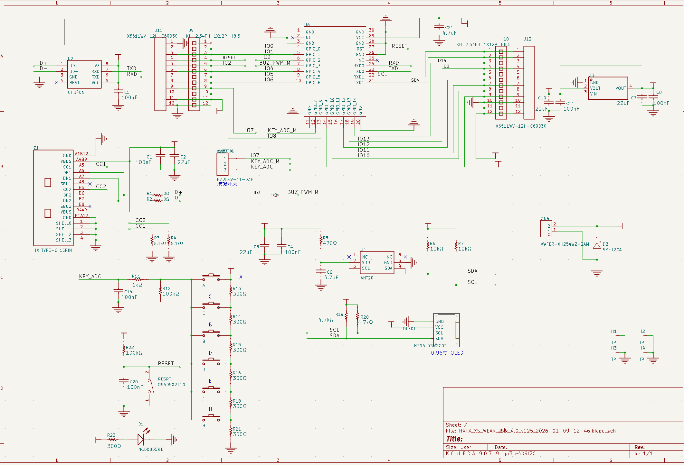
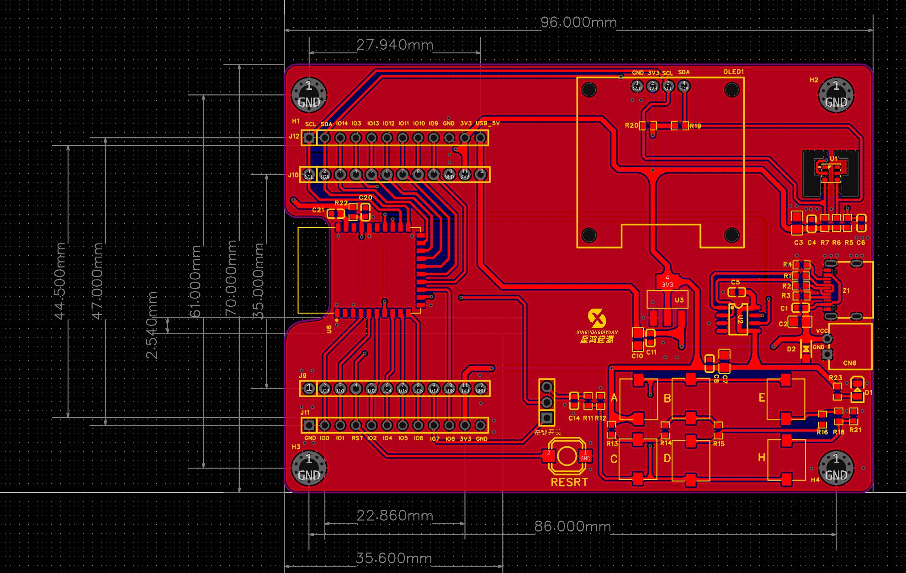

# 星鸿派-星闪开发板

本仓库收录 **星鸿派-星闪开发板** 的公开资料，原项目地址：

https://p.eda.cn/d-1328625634846441472

## 项目简介



星鸿派-星闪开发板是一款基于海思 WS63V100 系列平台的开源星闪开发板，支持 Wi-Fi、BLE 和 SLE 通信，可用于智能家电、物联网智能终端、无线通信教学、嵌入式系统实验和 OpenHarmony 应用验证等场景。

开发板配置了 0.96 寸 OLED 显示屏、六个用户按键、一个复位按键，以及 AHT20 温湿度传感器。无需额外焊接复杂电路，即可完成供电、串口调试、温湿度采集、OLED 显示、按键交互和外设扩展等基础实验。

## 基本信息

| 项目 | 内容 |
| --- | --- |
| 项目名称 | 星鸿派-星闪开发板 |
| 项目作者 | 星鸿派 |
| 发布时间 | 2026-01-15 13:37:14 |
| 主控平台 | 海思 WS63V100 系列 |
| 通信能力 | Wi-Fi、BLE、SLE/星闪 |
| 操作系统 | OpenHarmony |
| 硬件设计 | KiCad 工程，双层 PCB |
| PCB 尺寸 | 约 96 mm x 70 mm |
| 开源协议 | CERN Open Hardware License |

## 仓库目录

```text
.
├── assets/
│   └── images/                    # 项目封面、原理图预览、PCB 预览等图片
├── docs/
│   ├── course/                    # 课程文档
│   └── ws63-official/             # WS63 系列官方文档
├── enclosure/
│   └── README.md                  # 外壳/结构件说明
├── hardware/
│   ├── bom/                       # BOM 清单
│   └── pcb/                       # KiCad 原理图与 PCB 工程
├── software/
│   ├── hispark-sdk-non-oh/        # Hispark 官方 SDK 方式示例
│   ├── resources/                 # 驱动、烧录、串口调试等软件资料
│   └── source/                    # OpenHarmony 示例源码
├── MANIFEST.json
└── README.md
```

## 硬件说明

项目硬件完全开源，原项目提供了原理图、PCB、BOM 等设计资料。硬件围绕“供电 + 串口调试 + 温湿度采集 + OLED 显示 + 用户交互 + 外设扩展”组织，适合作为 OpenHarmony 与星闪通信实验平台。

### 原理图预览



### PCB 预览



### 硬件设计文件

| 文件 | 说明 |
| --- | --- |
| `HXTX_XS_WEAR.sch` | 原理图文件 |
| `HXTX_XS_WEAR.pcb` | PCB 文件，源项目标注 PCB 尺寸约 96 mm x 70 mm，双层板 |
| `BOM_Board1_Schematic1_2026-01-09.xlsx` | 完整元件清单，含采购链接参考 |

### 板载资源

| 模块 | 主要器件/规格 | 数量 | 功能说明 |
| --- | --- | ---: | --- |
| 电源接口 | HXT TYPE-C-16PIN | 1 | USB Type-C 供电 / 数据接口 |
| 稳压芯片 | AMS1117-3.3 或兼容器件 | 1 | 5 V 转 3.3 V 稳压 |
| USB 转串口 | CH340N | 1 | USB 转 TTL 串口 |
| 温湿度传感器 | AHT20 | 1 | I2C 温湿度采集 |
| 显示屏 | 0.96 寸 I2C OLED，128 x 64 | 1 | 数据与状态显示 |
| 输入元件 | PZZ254V-11-03P 拨码 | 1 | 模式选择 |
| 复位按键 | OSHDS02110 | 1 | 系统复位 |
| 指示灯 | NCDB080BR1 LED | 1 | 电源状态提示 |
| 被动元件 | 100 nF / 22 μF 电容、10 kΩ 电阻等 | 若干 | 滤波、分压、上拉 |
| 扩展接口 | WAFER-ER-XH2.54 系列 | 4 | 外设扩展引脚 |

### 外设扩展

开发板提供扩展引脚，排母、排针均有引出，可直接连接人体感应传感器、继电器、电机驱动、OLED、按键矩阵等外设，减少额外飞线和外围电路搭建工作。

## 软件与课程资料

### OpenHarmony 示例源码

`02-程序源码.zip` 中包含多类基础与外设实验示例，可用于学习 OpenHarmony 应用开发、驱动调用和板载外设控制。示例覆盖线程、定时器、互斥锁、信号量、消息队列、GPIO、OLED、AHT20、PWM、Wi-Fi 等方向。

### 软件工具

`03-软件资料.zip` 中包含常用调试与烧录工具，包括 USB 转串口驱动、串口调试助手，以及海思芯片烧录工具等，适合配合课程文档完成环境搭建、程序下载和串口日志查看。

### Hispark 官方 SDK 方式

`05-Hispark官方SDK方式（非OH）.zip` 提供非 OpenHarmony 方式的 Hispark SDK 示例，可作为对照学习或底层实验参考。

### WS63 官方文档

`06-WS63系列官方文档.zip` 包含 WS63V100 相关官方资料，覆盖 AT 命令、BOOT API、CJSON、CoAP、HTTP、MQTT、lwIP、TLS/DTLS、NV 存储、文件系统、设备驱动、快速入门等内容。

## 项目价值

- 技术融合：围绕“星闪 + OpenHarmony + 海思平台”构建完整开源开发板，便于验证新一代近场通信与国产开源操作系统生态。
- 开发友好：板载常用传感器、显示、按键、串口和扩展接口，降低入门实验与二次开发门槛。
- 教学适配：配套课程文档和示例代码，适合学生、教师、创客、工程师和研究者用于教学、实验、原型验证和产品评估。
- 生态完整：资料覆盖硬件设计、BOM、示例源码、软件工具、课程文档和芯片官方文档，便于从硬件复刻到软件开发形成闭环。

## 外壳与结构件

本次公开资料中未发现独立外壳、结构件或 3D 打印文件，例如 `.stl`、`.step`、`.stp`、`.iges`。因此 `enclosure/` 目录暂保留说明文件，后续如项目方公开外壳资料，可继续补充到该目录。

## 核心共建单位

广州星鸿起源科技有限公司、深圳华秋智联股份有限公司、深圳星骥智能科技有限公司、华南理工大学开源鸿蒙技术俱乐部、南方科技大学开源鸿蒙技术俱乐部、广东东软学院、金华职业技术大学、蜀鸿会、全国开源鸿蒙智能终端与物联行业产教融合共同体、开源高校联盟。

## 开源协议

本仓库开源协议为 **CERN Open Hardware License**。

## 文件说明

| 路径 | 内容 |
| --- | --- |
| `hardware/pcb/01-星鸿派PCB.zip` | KiCad 硬件工程，包含原理图、PCB 与工程文件 |
| `hardware/bom/BOM_Board1_Schematic1_2026-01-09.xlsx` | 完整元件清单，含采购信息参考 |
| `software/source/02-程序源码.zip` | OpenHarmony 示例源码，包含线程、定时器、GPIO、OLED、AHT20、PWM、Wi-Fi 等实验示例 |
| `software/resources/03-软件资料.zip` | USB 转串口驱动、串口调试助手、海思芯片烧录工具等 |
| `docs/course/04-课程文档.zip` | 开发环境搭建、烧录、外设实验、Wi-Fi 等课程文档 |
| `software/hispark-sdk-non-oh/05-Hispark官方SDK方式（非OH）.zip` | Hispark 官方 SDK 方式示例代码 |
| `docs/ws63-official/06-WS63系列官方文档.zip` | WS63V100 官方 PDF、CHM、Markdown 资料 |
| `assets/images/cover.png` | 项目封面图 |
| `assets/images/schematic-preview.png` | 原理图预览图 |
| `assets/images/pcb-preview.png` | PCB 预览图 |

## 使用建议

1. 硬件设计请优先查看 `hardware/pcb/01-星鸿派PCB.zip`，使用 KiCad 打开工程文件。
2. 物料采购、焊接或复刻前，请核对 `hardware/bom/` 中的 BOM，并结合原理图、PCB 与实际版本确认封装和替代料。
3. OpenHarmony 示例请从 `software/source/02-程序源码.zip` 解压后查看。
4. 非 OpenHarmony / Hispark SDK 方式示例请查看 `software/hispark-sdk-non-oh/`。
5. 烧录、串口、驱动类工具请查看 `software/resources/03-软件资料.zip`。
6. WS63V100 芯片能力、AT、MQTT、HTTP、lwIP、TLS/DTLS、文件系统等接口资料请查看 `docs/ws63-official/06-WS63系列官方文档.zip`。
7. 若需要二次开发，建议先完成 GPIO、定时器、串口、OLED、AHT20 等基础实验，再扩展 Wi-Fi、星闪通信和外设联动应用。

## 重要声明

- 本仓库保留原项目公开资料，未对硬件、软件、文档或工具包内容做二次编辑。
- 版权、商标、许可证和使用风险以原项目方及附件内声明为准。
- 第三方工具、驱动、烧录软件和芯片文档可能各自带有独立许可或使用限制，使用前请自行核对。
